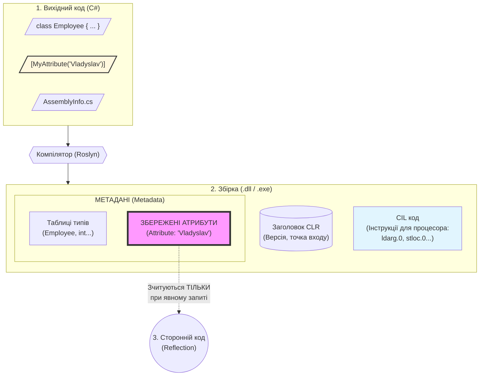

# Модуль 13. Серіалізація об'єктів. Логування

## Зміст
1. [Поняття атрибутів](#поняття-атрибутів)
2. [Серіалізація](#серіалізація)
3. [Відношення між об'єктами](#відношення-між-обєктами)
4. [Графи відношень об'єктів](#графи-відношень-обєктів)
5. [Атрибути для серіалізації](#атрибути-для-серіалізації)
6. [Формати серіалізації](#форми-серіалізації)
7. [Логування](#логуювання)
8. [Інструменти логування](#інструменти-логуювання)
9. [Практичні приклади](#практичні-приклади)

---

## Поняття атрибутів

**Атрибути (Attributes)** в C# - це спеціальні класи, які дозволяють додавати метадані до програмних елементів (класів, методів, властивостей, полів тощо). Атрибути надають додаткову інформацію про елементи коду, яку можна використовувати під час виконання програми через рефлексію.

Першніж розібрати основні характеристики атрибутів, розглянемо поняття, як метадані та рефлексія.

**Поняття метаданих** - треба чітко розмежувати дві речі: те, що програма робить **(код)**, і те, що програма знає про себе **(метадані)**.

Аналогія з життя **"Книга та Бібліотечна картка"**.
Уявіть, що ваша програма (Збірка / .dll) - це Книга.
- CIL-код (Методи, логіка): Це текст роману. Сюжет, діалоги, дії героїв. Коли ви читаєте (виконуєте програму), ви стежите за сюжетом.
- Метадані: Це бібліотечна картка або сторінка з вихідними даними на початку книги. Там написано: Автор, Рік видання, Жанр, Кількість сторінок.
- Атрибут: Це як штамп на цій картці "Для службового користування" або наліпка "Бестселер".

**Технічне пояснення**
Коли компілятор бачить атрибут, він робить наступне:

1. Не створює об'єкт: Він не створює екземпляр класу CoderAttribute в момент запуску програми (як це робиться з new Employee()).

2. Серіалізує дані: Компілятор бере значення, які ви передали в дужках, і перетворює їх на набір байтів (binary blob).

3. Записує в таблицю: У файлі .dll є спеціальні таблиці (як Excel). Компілятор знаходить таблицю Attribute і додає туди рядок:
    - До чого прив'язано: Метод IncreaseWages.
    - Який атрибут: Attribute.
    - Значення: "Some Value" (у вигляді байтів).

`Головна думка`: Атрибут у метаданих — це **"заморожена"** інформація. Вона лежить на диску всередині .dll файлу і чекає. Вона не займає пам'ять (RAM) і не споживає процесорний час, доки ви явно не попросите її прочитати через `Рефлексію`.

**P.S.** - Attribute, це як коментар, який вижив після компіляції і який програма може прочитати сама про себе

**Рефлексія (Reflection)** — це механізм у .NET, який дозволяє програмі бачити, досліджувати та змінювати саму себе під час виконання.
- `Звичайний код` працює з даними (числами, рядками, користувачами).
- `Рефлексія` працює з типами (класами, методами, властивостями). Вона дозволяє коду подивитися в дзеркало і спитати: "Хто я? Які у мене є методи? Які атрибути на мені висять?"

За допомогою простору імен `System.Reflection`, ви можете робити речі, які неможливі при звичайному написанні коду:

- **Дізнаватися структуру**: Отримати список усіх класів у `.dll`, список усіх методів у класі, типи аргументів тощо.
- **Читати Атрибути**: Саме рефлексія зчитує ваші [Attribute("SomeText")], [Key], [Obsolete]. Без рефлексії атрибути — це просто мертвий текст.
- **Створювати об'єкти "на льоту"**: Ви можете створити екземпляр класу, знаючи лише його назву у вигляді рядка "MyProject.Employee".
- **Викликати методи**: Ви можете запустити метод, не пишучи його ім'я в коді явно, а знайшовши його за назвою.
- **Ламати приватність**: Рефлексія дозволяє читати і змінювати private поля (хоча це ПОГАНА ПРАКТИКА!!!!!).

### Приклад: Звичайний код vs Рефлексія

Звичайний підхід (Ми знаємо все наперед):
```csharp
Cat myCat = new Cat();
myCat.Meow(); // Ми знаємо, що метод називається Meow
```

Підхід через Рефлексію (Ми нічого не знаємо, діємо наосліп):
```csharp
// 1. Отримуємо інформацію про тип (читаємо метадані)
Type catType = typeof(Cat); 

// 2. Створюємо об'єкт (не використовуючи new Cat())
object myCatObj = Activator.CreateInstance(catType);

// 3. Шукаємо метод за назвою (у вигляді рядка!)
MethodInfo meowMethod = catType.GetMethod("Meow");

// 4. Викликаємо метод
meowMethod.Invoke(myCatObj, null);
```
### Де це використовується в реальності?
- Serialization (JSON/XML): Коли JsonSerializer перетворює ваш об'єкт у текст, він використовує рефлексію, щоб пробігтися по всіх полях об'єкта і прочитати їх значення.
- Entity Framework (Бази даних): Вона використовує рефлексію, щоб зв'язати ваші класи (User) з таблицями в базі (Users).
- Dependency Injection (DI): Коли ви пишете в конструкторі public Service(ILogger logger), DI-контейнер через рефлексію дивиться на конструктор, бачить, що там потрібен ILogger, створює його і передає вам.
- Unit Tests: Тестові фреймворки (xUnit, NUnit) шукають методи з атрибутом [Test] саме через рефлексію, щоб запустити їх.

### Основні характеристики атрибутів:
- **Зберігання в метаданих** - атрибути зберігаються в метаданих збірки
- **Доступ через рефлексію** - можна отримати інформацію про атрибути під час виконання
- **Декларативність** - атрибути дозволяють декларативно описувати поведінку
- **Не впливають на виконання** - атрибути самі по собі не змінюють логіку виконання коду

### Синтаксис використання:
```csharp
[AttributeName]
public class MyClass
{
    [AttributeName(parameter)]
    public void MyMethod() { }
}
```

### Приклад використання:
```csharp
[Serializable]
public class Person
{
    [NonSerialized]
    private int age;
    
    public string Name { get; set; }
}
```


<details>
<summary><strong>1. Зона "Source" (Ліворуч): Що ми пишемо</strong></summary>

У вихідному коді (Source) ми бачимо клас `Employee` та атрибут `MyAttribute`.

</details>

<details>
<summary><strong>2. Процес "Compiler" (Центр): Сортування</strong></summary>

Компілятор (**Roslyn**) працює як розумний сортувальник сміття. Він бере ваш єдиний файл коду і розкладає його на дві різні купи:

* **Логіку** (`if`/`else`/`loops`) він перетворює на **CIL код**.
* **Описи** (Атрибути) він перетворює на **Метадані**.

</details>

<details>
<summary><strong>3. Зона "Assembly" (Всередині файлу .dll/.exe)</strong></summary>

Тут відбувається магія розділення:

* **Блок CIL :** Це те, що виконує процесор. Тут лежать інструкції типу `add`, `ret`, `ldstr`. Зверніть увагу: **тут немає згадки про атрибут**. Коли програма працює, вона "не бачить" атрибутів.
* **Блок Metadata :** Це "паспортний стіл" програми. Атрибут `MyAttribute` лежить тут як запис у базі даних. Він просто зберігає текст `"Vladyslav"`. Він пасивний.

</details>

<details>
<summary><strong>4. Зона "Reader" (Низ): Хто це читає?</strong></summary>

Це ключовий момент схеми — **пунктирна стрілка**.

* **Чому пунктирна?** Тому що цей зв'язок *необов'язковий*.
* Виконання програми (стрілки `Source -> Compiler -> Assembly`) йде прямо.
* А зчитування атрибута (стрілка `Attributes -.-> Reader`) відбувається **тільки тоді**, коли хтось (**Reflection**) спеціально про це попросить.

</details>

### Типи атрибутів:
- **Вбудовані атрибути** - частина .NET Framework (`[Serializable]`, `[Obsolete]`, `[Conditional]`)
- **Користувацькі атрибути** - створені розробником для специфічних потреб(inherit from base class YourAttributeClass : Attribute)

---

## Серіалізація

**Серіалізація** - це процес перетворення об'єкта в послідовність байтів або текстовий формат для збереження або передачі через мережу.

**Десеріалізація** - зворотний процес відновлення об'єкта з серіалізованих даних.

### Основні цілі серіалізації:

1. **Збереження стану об'єктів**
   - Збереження даних у файл
   - Збереження в базу даних
   - Збереження в кеш

2. **Передача даних**
   - Відправка об'єктів через мережу
   - Web-сервіси та API
   - Віддалені виклики методів (RPC)

3. **Клонування об'єктів**
   - Створення глибоких копій об'єктів
   - Копіювання складних графів об'єктів

4. **Кешування та персистентність**
   - Збереження об'єктів для подальшого використання
   - Відновлення стану програми

### Типи серіалізації:

#### 1. Бінарна серіалізація
- Перетворення в двійковий формат
- Найшвидша та найкомпактніша
- Не читабельна для людини

#### 2. XML серіалізація
- Перетворення в XML формат
- Читабельна для людини
- Незалежна від платформи

#### 3. JSON серіалізація
- Перетворення в JSON формат
- Легка та читабельна
- Широко використовується в веб-розробці

#### 4. SOAP серіалізація
- Перетворення в SOAP формат
- Використовується в веб-сервісах
- Базується на XML

#### 5. Користувацька серіалізація
- Реалізація власного формату
- Повний контроль над процесом
- Використання інтерфейсу `ISerializable`

### Процес серіалізації:

```
Об'єкт в пам'яті → Серіалізація → Послідовність байтів/текст → Збереження/Передача
```

### Процес десеріалізації:

```
Збережені дані → Десеріалізація → Відновлення об'єкта → Об'єкт в пам'яті
```

---

## Відношення між об'єктами

У об'єктно-орієнтованому програмуванні об'єкти можуть мати різні типи відношень, які важливо враховувати при серіалізації.

### 1. Асоціація (Association)
Простий зв'язок між об'єктами, де один об'єкт знає про інший.

**Приклад:**
```csharp
public class Employee
{
    public Department? Department { get; set; } // Асоціація
}
```

### 2. Агрегація (Aggregation)
Відношення "частина-ціле", де об'єкт може існувати незалежно від контейнера.

**Приклад:**
```csharp
public class Department
{
    public List<Employee> Employees { get; set; } // Агрегація
    // Employee може існувати без Department
}
```

### 3. Композиція (Composition)
Сильна форма агрегації, де об'єкт не може існувати без контейнера.

**Приклад:**
```csharp
public class Order
{
    public List<OrderItem> Items { get; set; } // Композиція
    // OrderItem не може існувати без Order
}
```

### 4. Наслідування (Inheritance)
Відношення "is-a", де клас успадковує властивості та методи базового класу.

**Приклад:**
```csharp
public class Person { }
public class Employee : Person { } // Наслідування
```

---

## Графи відношень об'єктів

**Граф об'єктів** - це структура, що представляє зв'язки між об'єктами. При серіалізації важливо враховувати особливості графів об'єктів.

### Особливості графів об'єктів:

#### 1. Циклічні посилання (Circular References)
Коли об'єкти посилаються один на одного, утворюючи цикл.

**Приклад:**
```csharp
public class Employee
{
    public Manager? Manager { get; set; }
}

public class Manager : Employee
{
    public List<Employee> TeamMembers { get; set; }
}

// Циклічне посилання:
// Manager → Employee → Manager
```

**Проблеми:**
- Можливість нескінченного циклу при серіалізації
- Потрібні спеціальні механізми обробки

**Рішення:**
- Використання посилань замість повних об'єктів
- Спеціальні атрибути для контролю серіалізації
- Користувацька серіалізація через `ISerializable`

#### 2. Глибина вкладеності
Складні ієрархії об'єктів з багатьма рівнями вкладеності.

**Приклад:**
```
Department
  └── Manager
      └── Employee[]
          └── Project[]
              └── Task[]
```

#### 3. Типи зв'язків
Різні типи зв'язків потребують різних підходів до серіалізації:
- **Один до одного** (1:1)
- **Один до багатьох** (1:N)
- **Багато до багатьох** (N:M)

### Приклад графу об'єктів у проекті:

```csharp
// Department має Manager та список Employee
public class Department
{
    public Manager? DepartmentManager { get; set; }
    public List<Employee> Employees { get; set; }
}

// Manager успадковує Employee та має список TeamMembers
public class Manager : Employee
{
    public List<Employee> TeamMembers { get; set; }
}
```

---

## Атрибути для серіалізації

### [Serializable]

Атрибут `[Serializable]` позначає клас як такий, що може бути серіалізований. Без цього атрибута об'єкт не можна серіалізувати за допомогою бінарної або SOAP серіалізації.

**Використання:**
```csharp
[Serializable]
public class Employee
{
    public string Name { get; set; }
    public int Id { get; set; }
}
```

**Важливо:**
- Потрібен для `BinaryFormatter` та `SoapFormatter`
- Не потрібен для `JsonSerializer` та `XmlSerializer`
- Застосовується до всього класу

### [NonSerialized]

Атрибут `[NonSerialized]` використовується для полів, які не повинні бути серіалізовані.

**Використання:**
```csharp
[Serializable]
public class User
{
    public string Username { get; set; }
    
    [NonSerialized]
    private string password; // Не буде серіалізовано
    
    [NonSerialized]
    private DateTime lastAccessTime; // Тимчасові дані
}
```

**Коли використовувати:**
- **Тимчасові дані** - дані, що не мають сенсу після перезапуску
- **Чутливі дані** - паролі, токени, ключі
- **Обчислювані значення** - властивості, що обчислюються на основі інших полів
- **Посилання на ресурси** - файли, мережеві з'єднання

**Приклад з проекту:**
```csharp
[Serializable]
public class Employee : Person
{
    public int EmployeeId { get; set; }
    public string Position { get; set; }
    
    [NonSerialized]
    private DateTime lastAccessTime; // Не серіалізується
}
```

---

## Формати серіалізації

### Простір імен System.Runtime.Serialization.Formatters

Цей простір імен містить класи для різних форматів серіалізації:
- `BinaryFormatter` - для бінарної серіалізації
- `SoapFormatter` - для SOAP серіалізації

**Важливо для .NET 8+:**
- `BinaryFormatter` та `SoapFormatter` **недоступні** в .NET Core/.NET 5+ та .NET 8+
- Вони доступні тільки в .NET Framework 4.8 та старіших версіях .NET Core
- Рекомендовано використовувати `System.Text.Json` або `Newtonsoft.Json` для JSON
- Для XML використовувати `XmlSerializer`

### Двійкове форматування (BinaryFormatter)

**BinaryFormatter** виконує бінарну серіалізацію об'єктів. Це найшвидший спосіб серіалізації, але формат не читабельний для людини.

**Переваги:**
- ✅ Швидкість серіалізації/десеріалізації
- ✅ Компактний розмір
- ✅ Збереження типів даних
- ✅ Підтримка складних графів об'єктів

**Недоліки:**
- ❌ Не читабельний формат
- ❌ Залежність від версії .NET
- ❌ Проблеми безпеки (застарілий підхід)
- ❌ **Недоступний в .NET 8+**

**Приклад (для .NET Framework):**
```csharp
BinaryFormatter formatter = new BinaryFormatter();
using (FileStream stream = new FileStream("data.bin", FileMode.Create))
{
    formatter.Serialize(stream, myObject);
}
```

**Альтернатива для .NET 8+:**
У проекті використовується `BinaryWriter` для демонстрації концепції бінарної серіалізації.

### SOAP-форматування (SoapFormatter)

**SoapFormatter** виконує серіалізацію в формат SOAP (Simple Object Access Protocol). Формат читабельний і базується на XML.

**Переваги:**
- ✅ Читабельний формат (XML)
- ✅ Незалежність від платформи
- ✅ Підтримка складних графів об'єктів
- ✅ Використовується в веб-сервісах

**Недоліки:**
- ❌ Більший розмір порівняно з бінарним форматом
- ❌ Повільніша серіалізація
- ❌ **Недоступний в .NET 8+**

**Приклад (для .NET Framework):**
```csharp
SoapFormatter formatter = new SoapFormatter();
using (FileStream stream = new FileStream("data.soap", FileMode.Create))
{
    formatter.Serialize(stream, myObject);
}
```

**Альтернатива для .NET 8+:**
У проекті використовується `XmlSerializer` для демонстрації концепції XML/SOAP серіалізації.

### JSON серіалізація (System.Text.Json)

**System.Text.Json** - сучасний підхід до серіалізації, рекомендований для нових проектів.

**Переваги:**
- ✅ Доступний у всіх версіях .NET
- ✅ Висока продуктивність
- ✅ Читабельний формат
- ✅ Широко використовується в веб-розробці
- ✅ Легка інтеграція з API

**Приклад:**
```csharp
var options = new JsonSerializerOptions
{
    WriteIndented = true,
    PropertyNamingPolicy = JsonNamingPolicy.CamelCase
};

string json = JsonSerializer.Serialize(myObject, options);
var deserialized = JsonSerializer.Deserialize<MyClass>(json, options);
```

### Створення користувацького формату серіалізації. Інтерфейс ISerializable

Для повного контролю над процесом серіалізації можна реалізувати інтерфейс `ISerializable`. Це дозволяє:
- Контролювати, які дані серіалізуються
- Обробляти версіонування
- Оптимізувати розмір серіалізованих даних
- Обробляти складні графи об'єктів
- Обробляти циклічні посилання

**Інтерфейс ISerializable:**
```csharp
public interface ISerializable
{
    void GetObjectData(SerializationInfo info, StreamingContext context);
}
```

**Метод GetObjectData:**
Викликається під час серіалізації для збору даних, які потрібно серіалізувати.

**Конструктор для десеріалізації:**
```csharp
protected MyClass(SerializationInfo info, StreamingContext context)
{
    // Відновлення даних з SerializationInfo
    Name = info.GetString(nameof(Name)) ?? string.Empty;
    Value = info.GetInt32(nameof(Value));
}
```

**Приклад з проекту:**
```csharp
[Serializable]
public class CustomSerializableClass : ISerializable
{
    public string Name { get; set; }
    public int Value { get; set; }
    
    [NonSerialized]
    private string? temporaryData;
    
    // Метод серіалізації
    public void GetObjectData(SerializationInfo info, StreamingContext context)
    {
        info.AddValue(nameof(Name), Name);
        info.AddValue(nameof(Value), Value);
        info.AddValue("Version", 1); // Версіонування
    }
    
    // Конструктор десеріалізації
    protected CustomSerializableClass(SerializationInfo info, StreamingContext context)
    {
        Name = info.GetString(nameof(Name)) ?? string.Empty;
        Value = info.GetInt32(nameof(Value));
        temporaryData = null; // Не відновлюється
    }
}
```

**Важливо:**
- `ISerializable` працює з `BinaryFormatter` та `SoapFormatter`
- Для JSON серіалізації використовуються інші механізми (конвертери)

---

## Логування

### Що таке логування?

**Логування (Logging)** - це процес запису інформації про виконання програми в файли, консоль, базу даних або інші цілі. Логи містять інформацію про події, помилки, попередження та діагностичні дані.

### Цілі та завдання логування

1. **Діагностика проблем**
   - Виявлення та аналіз помилок
   - Відстеження винятків
   - Розуміння причин збоїв

2. **Моніторинг системи**
   - Відстеження роботи додатку
   - Контроль продуктивності
   - Виявлення аномалій

3. **Аудит**
   - Збереження історії дій користувачів
   - Відстеження змін даних
   - Забезпечення відповідальності

4. **Аналіз продуктивності**
   - Виявлення вузьких місць
   - Вимірювання часу виконання операцій
   - Оптимізація коду

5. **Безпека**
   - Відстеження підозрілих дій
   - Логування спроб несанкціонованого доступу
   - Аналіз загроз

### Ситуації, що вимагають логування

#### 1. Помилки (Errors)
Критичні помилки, що потребують негайної уваги, але не зупиняють виконання програми.

**Приклад:**
```csharp
try
{
    // Код, що може викликати помилку
}
catch (Exception ex)
{
    logger.Error(ex, "Помилка при обробці даних");
}
```

#### 2. Попередження (Warnings)
Потенційні проблеми, що можуть призвести до помилок у майбутньому.

**Приклад:**
```csharp
if (userAge < 18)
{
    logger.Warn("Користувач неповнолітній: {Age}", userAge);
}
```

#### 3. Інформація (Information)
Загальна інформація про виконання програми, важливі події.

**Приклад:**
```csharp
logger.Info("Користувач {UserName} увійшов в систему", userName);
```

#### 4. Відлагодження (Debug)
Детальна інформація для розробників під час розробки та тестування.

**Приклад:**
```csharp
logger.Debug("Обробка запиту: {RequestId}, параметри: {@Parameters}", requestId, parameters);
```

#### 5. Трасування (Trace)
Найдетальніша інформація, використовується для глибокого аналізу.

**Приклад:**
```csharp
logger.Trace("Вхід в метод ProcessData з параметрами: {Param1}, {Param2}", param1, param2);
```

### Рівні логування

Рівні логування в порядку від найнижчого до найвищого:

1. **Trace** - найнижчий рівень, найдетальніша інформація
2. **Debug** - інформація для відлагодження
3. **Info** - загальна інформація про виконання
4. **Warn** - попередження про потенційні проблеми
5. **Error** - помилки, що не зупиняють виконання
6. **Fatal** - критичні помилки, що зупиняють програму

**Принцип фільтрації:**
Якщо встановлено рівень `Info`, то будуть логуватися повідомлення рівнів `Info`, `Warn`, `Error` та `Fatal`, але не `Debug` та `Trace`.

### Цілі логування (Targets/Sinks)

Логи можуть записуватися в різні місця:

- **Консоль** - вивід в консоль
- **Файли** - запис у файли
- **База даних** - збереження в БД
- **Email** - відправка на email
- **Система моніторингу** - інтеграція з системами моніторингу
- **Хмара** - сервіси логування в хмарі

---

## Інструменти логування

### log4net

**log4net** - популярна бібліотека логування для .NET, портована з Java log4j.

#### Особливості:
- Гнучка конфігурація через XML або код
- Множинні апендери (файли, консоль, база даних, email)
- Фільтрація логів за рівнями
- Форматування повідомлень
- Контекстне логування

#### Переваги:
- ✅ Зрілість та стабільність
- ✅ Велика спільнота
- ✅ Багато документації
- ✅ Довгий час на ринку

#### Недоліки:
- ❌ Складніша конфігурація
- ❌ Менш сучасний API
- ❌ Менша продуктивність порівняно з сучасними альтернативами

#### Приклад використання:
```csharp
private static readonly ILog log = LogManager.GetLogger(typeof(MyClass));

log.Debug("Debug message");
log.Info("Info message");
log.Warn("Warning message");
log.Error("Error message", exception);
log.Fatal("Fatal message");
```

#### Контекстне логування:
```csharp
LogicalThreadContext.Properties["UserId"] = "12345";
log.Info("User action");
```

### Serilog

**Serilog** - сучасна бібліотека логування з акцентом на структуровані логи.

#### Особливості:
- **Структуровані логи** (structured logging) - ключова особливість
- Fluent API для конфігурації
- Багато sink'ів (цілей для логів)
- Підтримка обогащення логів
- Легка інтеграція з системами моніторингу

#### Переваги:
- ✅ Сучасний та зручний API
- ✅ Структуровані логи легко аналізувати
- ✅ Хороша продуктивність
- ✅ Легка конфігурація
- ✅ Підтримка обогащення логів

#### Недоліки:
- ❌ Менша зрілість порівняно з log4net
- ❌ Менше прикладів у старому коді

#### Приклад використання:
```csharp
Log.Logger = new LoggerConfiguration()
    .MinimumLevel.Debug()
    .WriteTo.Console()
    .WriteTo.File("logs/app-.txt", rollingInterval: RollingInterval.Day)
    .CreateLogger();

Log.Information("User {UserName} (ID: {UserId}) logged in", userName, userId);
Log.Error(exception, "Error processing order {OrderId}", orderId);
```

#### Структуровані логи:
```csharp
// Структуровані дані легко аналізувати
Log.Information("Order {OrderId} processed for customer {CustomerId} with total {Total:C}", 
                12345, 98765, 199.99m);
```

### NLog

**NLog** - потужна та гнучка бібліотека логування для .NET.

#### Особливості:
- Проста конфігурація
- Висока продуктивність
- Багато цілей (targets) для логів
- Асинхронне логування
- Правила та фільтри
- Контекстне логування

#### Переваги:
- ✅ Висока продуктивність
- ✅ Гнучка конфігурація
- ✅ Добра документація
- ✅ Активна розробка
- ✅ Підтримка асинхронного логування

#### Недоліки:
- ❌ Може бути надмірно складним для простих випадків

#### Приклад використання:
```csharp
private static readonly Logger logger = LogManager.GetCurrentClassLogger();

logger.Trace("Trace message");
logger.Debug("Debug message");
logger.Info("Info message");
logger.Warn("Warning message");
logger.Error(exception, "Error message");
logger.Fatal("Fatal message");
```

#### Контекстне логування:
```csharp
MappedDiagnosticsContext.Set("UserId", "12345");
logger.Info("User action");
```

### Порівняння інструментів

| Критерій | log4net | Serilog | NLog |
|----------|---------|---------|------|
| Зрілість | ⭐⭐⭐⭐⭐ | ⭐⭐⭐⭐ | ⭐⭐⭐⭐⭐ |
| Продуктивність | ⭐⭐⭐ | ⭐⭐⭐⭐ | ⭐⭐⭐⭐⭐ |
| Сучасність API | ⭐⭐ | ⭐⭐⭐⭐⭐ | ⭐⭐⭐⭐ |
| Структуровані логи | ⭐⭐ | ⭐⭐⭐⭐⭐ | ⭐⭐⭐⭐ |
| Конфігурація | ⭐⭐⭐ | ⭐⭐⭐⭐⭐ | ⭐⭐⭐⭐ |
| Документація | ⭐⭐⭐⭐⭐ | ⭐⭐⭐⭐ | ⭐⭐⭐⭐⭐ |

### Коли використовувати який інструмент?

**log4net:**
- Успадковані проекти
- Потрібна максимальна сумісність
- Команда знайома з log4j

**Serilog:**
- Нові проекти
- Потрібні структуровані логи
- Інтеграція з сучасними системами моніторингу
- Сучасний та зручний API

**NLog:**
- Потрібна висока продуктивність
- Складні вимоги до конфігурації
- Асинхронне логування
- Багато цілей для логів

---

## Практичні приклади

У проекті наведені практичні приклади використання всіх розглянутих концепцій.

### Структура проекту:

```
Module13ConsoleApp/
├── Models/                          # Моделі даних
│   ├── Person.cs                    # Базовий клас з [Serializable]
│   ├── Employee.cs                  # Клас з [NonSerialized]
│   ├── Manager.cs                   # Наслідування та відношення
│   ├── Department.cs                # Граф об'єктів
│   └── CustomSerializableClass.cs   # ISerializable реалізація
├── Serialization/                    # Приклади серіалізації
│   ├── BinarySerializationExample.cs
│   ├── SoapSerializationExample.cs
│   ├── JsonSerializationExample.cs
│   └── CustomSerializationExample.cs
├── Logging/                          # Приклади логування
│   ├── Log4NetExample.cs
│   ├── SerilogExample.cs
│   └── NLogExample.cs
└── Program.cs                        # Головний файл з меню
```

### Запуск прикладів:

1. **Запустіть проект:**
   ```bash
   dotnet run
   ```

2. **Виберіть приклад з меню:**
   - Бінарна серіалізація
   - SOAP/XML серіалізація
   - JSON серіалізація
   - Користувацька серіалізація
   - log4net логування
   - Serilog логування
   - NLog логування

3. **Перегляньте результати:**
   - Вивід в консоль
   - Створені файли (JSON, XML, бінарні)
   - Файли логів у папці `logs/`

### Приклади класів:

#### Person - базовий клас
```csharp
[Serializable]
public class Person
{
    public string FirstName { get; set; }
    public string LastName { get; set; }
    public int Age { get; set; }
    public string Email { get; set; }
}
```

#### Employee - клас з NonSerialized
```csharp
[Serializable]
public class Employee : Person
{
    public int EmployeeId { get; set; }
    public string Position { get; set; }
    
    [NonSerialized]
    private DateTime lastAccessTime; // Не серіалізується
}
```

#### Manager - граф об'єктів
```csharp
[Serializable]
public class Manager : Employee
{
    public List<Employee> TeamMembers { get; set; }
    
    [NonSerialized]
    private string? temporaryNotes;
}
```

#### CustomSerializableClass - ISerializable
```csharp
[Serializable]
public class CustomSerializableClass : ISerializable
{
    public string Name { get; set; }
    public int Value { get; set; }
    
    [NonSerialized]
    private string? temporaryData;
    
    public void GetObjectData(SerializationInfo info, StreamingContext context)
    {
        // Контрольована серіалізація
    }
}
```

---

## Додаткові ресурси

### Документація Microsoft:
- [Serialization in .NET](https://docs.microsoft.com/dotnet/standard/serialization/)
- [System.Text.Json](https://docs.microsoft.com/dotnet/api/system.text.json)
- [Attributes in C#](https://docs.microsoft.com/dotnet/csharp/programming-guide/concepts/attributes/)

### Бібліотеки логування:
- [log4net Documentation](https://logging.apache.org/log4net/)
- [Serilog Documentation](https://serilog.net/)
- [NLog Documentation](https://nlog-project.org/)

### Корисні статті:
- [Best Practices for Logging](https://docs.microsoft.com/dotnet/core/extensions/logging)
- [Serialization Best Practices](https://docs.microsoft.com/dotnet/standard/serialization/best-practices)

---

## Примітки

### Про .NET 8+ та застарілі формати:

**BinaryFormatter та SoapFormatter:**
- Недоступні в .NET Core/.NET 5+ та .NET 8+
- Доступні тільки в .NET Framework 4.8
- Рекомендовано використовувати `System.Text.Json` для нових проектів

**Альтернативи:**
- **JSON:** `System.Text.Json` або `Newtonsoft.Json`
- **XML:** `XmlSerializer`
- **Бінарні дані:** `BinaryWriter`/`BinaryReader` для простих випадків

### Рекомендації:

1. **Для нових проектів:** використовуйте `System.Text.Json`
2. **Для логування:** оберіть один інструмент (Serilog або NLog для нових проектів)
3. **Для серіалізації:** уникайте `BinaryFormatter` через проблеми безпеки
4. **Для графів об'єктів:** уважно обробляйте циклічні посилання